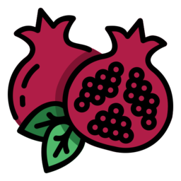

# JS Старт. Практическая работа на курсе _SkillFactory_ **'Профессия Веб-разработчик'**

# Проект: "Список экзотических фруктов"

Проект состоит из одной страницы.

### На странице используются собственные разработанные стили, а именно:

-   Используются **шрифты Google-fonts**: (_'Montserrat'; 'El Messiri', 'PT Sans', sans-serif;_).

-   **Дизайн страницы** реализован на основе бесплатного PSD-макета.

-   **Цвет фона и шрифта контрастны**.

-   На странице реализована **плавная анимация** при взаимодействии с определенными элементами (ссылки, кнопки и т.д.).

-   В этом проекте использовал **псевдоэлементы** и **псевдоклассы** для улучшения внешнего вида.

-   При определенных сценариях пользователь получает всплывающие сообщения (**pop-up**).

-   Добавлена **иконка** во вкладку браузера (favicon).

-   Заполнены мета данные страницы.

-   Страница хорошо смотрится на **мобильных устройствах** с шириной экрана до _360px_ (добавлен **адаптив**).

-   **Страница проверена** в валидаторе W3C и Google Lighthouse.

## Используемые технологии

-   **HTML**

-   **CSS**

-   **JavaScript**

## Как открыть/запустить

-   Зайти в папку сайта в файловом менеджере, кликнуть 2 раза по файлу **_index.html_**.

-   Нажмите кнопку **'Перемешать'**, чтобы перемешать элементы списка в **_случайном порядке_**.

-   Нажмите кнопку **'Фильтровать'**, чтобы отфильтровать элементы списка по **_полю вес_**.

-   Нажмите кнопку **'Сортировать'**, чтобы отсортировать элементы списка по **_полю цвет_** в указанном порядком.

-   Нажмите кнопку **'Сменить алгоритм сортировки'** для смены алгоритма сортировки по **_полю цвет_**. Доступны
    алгоритмы: **_bubbleSort_** и **_quickSort_**.

-   Нажмите кнопку **'Добавить фрукт'** для добавления нового фрукта. Предварительно нужно обязательно заполнить все 3
    поля (Вид, Цвет, Вес). Если их не заполнить, пользователю покажется сообщение с предупреждением об ошибке ввода.

## Заключение

### Что удалось?

-   **Создал** простое приложение, используя JavaScript;

-   **Применил собственные стили** к этой странице;

-   **Закрепил знания** по HTML и CSS;

-   **Ознакомился** с базовыми возможностями **JavaScript**;

### Дальнейшие планы (что можно улучшить)

-   Упростить код. Попробовать решить задачу другим способом;

-   Устранить возможные баги, если обнаружатся;

-   Применить другие css стили;
